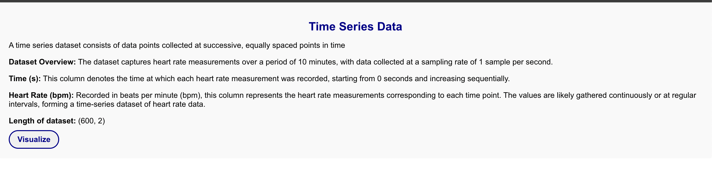
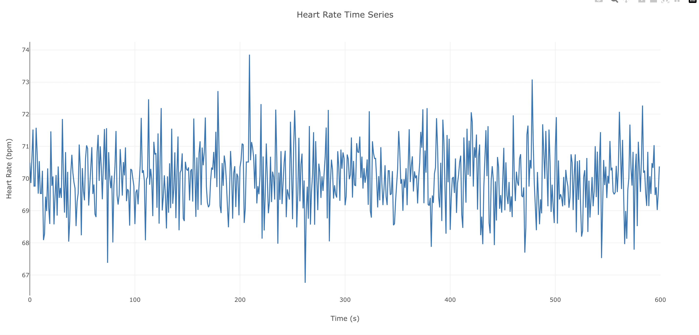
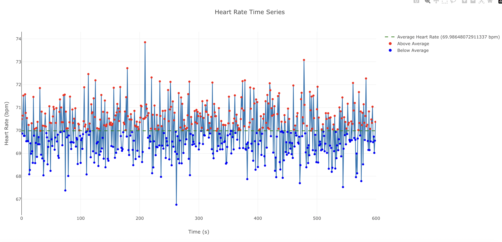

# Visualization using React

### To start project -  
1) ```cd timeseriesplot```
2) ```npm install```
3) ```npm start```

### Visualization with react-plotly.js -
Utilized react-plotly.js, a React library, to visualize the dataset.

### Implementation Details:
The index.js file renders the main App component.
Within App, initialize state variables: data starts as null and setData updates it once CSV data is fetched. Another state variable, showPlot, manages plot visibility using useState.
When data is null, trigger the fetchData function. This function uses the fetch API to retrieve the CSV file locally, defaulting to a GET request.
Handle the fetch API's promise; if the response isn't okay, manage errors within a catch block. Upon a successful response, use response.text() to obtain the CSV text, resolving it to csvText.
Convert csvText from a string into an array of objects using a custom parseCSV function, ensuring the data is structured correctly.
Store the parsed data in the component's state via setData, prompting a re-render of the component with updated data.
Component Organization:

App Component: Centralizes state management and renders child components.
Container Component: Wraps child components, applying styles via props.
TimeSeriesData Component: Static display of time-series data and dataset information.
VisualizeButton Component: Generates buttons to toggle between visualizations, managed with initial state set to false.
Interaction: Passes togglePlot function from App.js to ButtonContainer, where it triggers VisualizeButton upon clicking. This action alerts the parent component (App.js), updating showPlot to true via setShowPlot. Subsequently, data passes to TimeSeriesPlot for graph plotting, utilizing react-plotly to render time-series plots.





Reference: https://plotly.com/javascript/react/#advanced-usage

